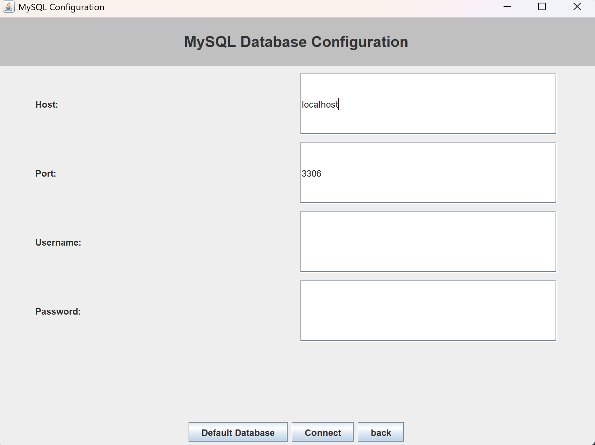

# 🎟️ How to Use the Ticketing System

Welcome to the Ticketing System! This is a desktop application designed for managing events and tickets, built using Java and SQLite. This guide will walk you through how to use the application with screenshots for each step.

---

## 🛠️ 1. Setup the Database

When you first run the program, you'll be prompted to choose a database:

**➡️ Choose your preferred database type:**

**➡️ Enter connection details if using SQLite:**

---

## 🔐 2. Login or Register

Once the database is connected, you'll be asked to either log in or register:

### Login or Register Page:

### Register Page:

### Login Page:

---

## 👤 3. Account Type Services

After login, you'll be redirected to services based on your account type:

### 🎭 Event Organizer:

### 🙋 Customer:

### 👨‍💼 Account Manager:

---

## 🎉 4. Creating an Event

As an Event Organizer, you can create new events:

---

## 🎫 5. Creating Ticket Types for Events

After creating an event, you can define different ticket types:

### Ticket types successfully added:

---

## 🗓️ 6. Selecting an Event

When browsing or managing tickets, select the desired event:

---

## 🛙️ 7. Browsing and Buying Tickets

As a customer, you can browse available tickets for sale:

### Buying a ticket:

---

## 📌 8. Selected Event Summary

Viewing a summary of a selected event:

---

## ✅ You're All Set!

You're now ready to explore and enjoy the features of the Ticketing System. Whether you're an event organizer, customer, or account manager—this system is built to streamline your ticketing experience.

---

> 🔄 If you need to reset or reconfigure the database, simply restart the app and go through the setup screens again.

Feel free to open an issue if you encounter any bugs or have feature suggestions! 😊