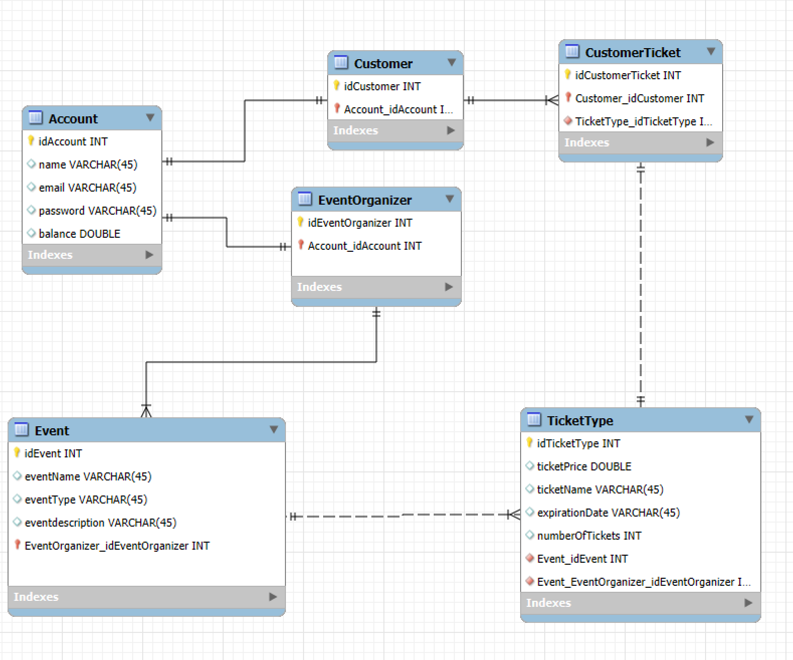
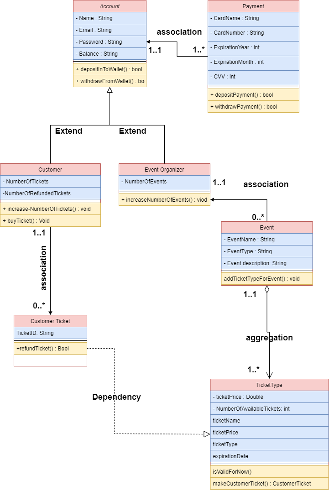

Sure! Here's the updated markdown with images included for better visualization:

## Architecture Design Files

This folder contains essential design documents for the Ticketing System project, including database schemas, UML diagrams, and other design resources. These files provide a comprehensive overview of the system's architecture and structure.

### Database designs:
- **DatabaseSchema.mwb**: The main database schema file, providing a detailed structure of the database.
- **DatabaseSchema.png**: A visual representation of the database schema.

  

### UML Digrams:

- **TicketingSystem.drawio**: A diagram file illustrating the architecture of the Ticketing System, created using draw.io.
- **TicketingSystem.drawio.png**: A PNG export of the Ticketing System architecture diagram.

  

- **README.md**: A README file containing an overview and additional information about the design files.

These documents help in understanding the system's design, data relationships, and the overall architecture of the project.